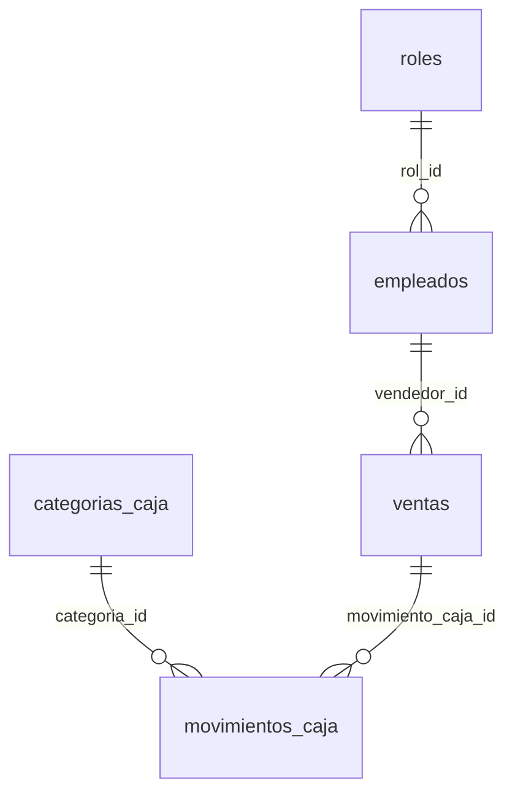

# AutoGestion ERP - Plataforma Inteligente de Gestión de Concesionarias

---

## 1. Resumen Ejecutivo y Enfoque de Negocio

**AutoGestion ERP** es una plataforma integral diseñada específicamente para digitalizar y automatizar el ciclo operativo completo de concesionarias automotrices. 

### El Enfoque de Negocio (Saliendo del ABM tradicional)
Este proyecto nació originalmente con la idea simple de ser un catálogo de vehículos con operaciones de alta, baja y modificación (ABM). Sin embargo, tras analizar de cerca cómo opera el día a día de una agencia física en Argentina, decidí dar un giro de 180 grados hacia una solución madura de negocio: un **micro-ERP contable y operativo**. 

En la realidad comercial de las concesionarias:
*   Las comisiones de los vendedores suelen calcularse manualmente en planillas de Excel propensas a errores.
*   El registro del flujo de caja (entradas por ventas, gastos operativos y sueldos) suele estar desconectado del control de stock físico.
*   El dueño (Owner) necesita aplicar con flexibilidad ajustes extraordinarios sobre la liquidación de haberes a fin de mes (para descontar días de falta, registrar adelantos o inyectar bonos imprevistos).

Por esta razón, diseñé una arquitectura que **cruza dinámicamente el control de stock con un módulo financiero real**. Cada venta no solo actualiza el estado del vehículo, sino que imputa comisiones al vendedor asignado y genera movimientos automáticos en el libro diario de caja, permitiendo luego liquidaciones de haberes flexibles y controladas en su totalidad desde el panel privado de administración.

---

## 2. Bitácora de Copiloto: Orquestación y Co-creación con IA

Desarrollar una plataforma con este nivel de robustez en tiempos acotados requirió adoptar un rol de dirección técnica y orquestar el desarrollo de forma inteligente utilizando a **Antigravity (Claude)** como copiloto de desarrollo avanzado.

### La IA como multiplicador de velocidad
La clave para lograr un MVP de calidad de producción en tiempo récord fue delegar las tareas repetitivas a la IA. Usé al copiloto para generar el boilerplate inicial, redactar el borrador de las migraciones SQL de Supabase y estructurar la maquetación responsiva con las clases utilitarias de Tailwind CSS v4. 
Esto me liberó para concentrar el **80% del esfuerzo y tiempo humano en las decisiones críticas de ingeniería**:
*   El diseño de la arquitectura de componentes y hooks en React.
*   El tipado estricto con interfaces e inferencia de tipos de TypeScript.
*   La lógica asíncrona y manejo de respuestas controladas en los Route Handlers de Next.js 16.
*   El control de transacciones y autenticación dinámica mediante el cliente de Supabase.

### Simplificación de Arquitectura
Durante la fase de diseño inicial de las features de IA, mi idea era construir dos endpoints y dos botones diferentes en la interfaz de carga de vehículos: uno para buscar la ficha técnica oficial del auto y otro para optimizar la redacción comercial del borrador escrito por el operador.
Tras analizar la complejidad de mantener múltiples llamadas de red y endpoints redundantes, propuse una **Simplificación de Arquitectura**: unifiqué todo en un único botón inteligente **"Reformular con IA"** respaldado por el endpoint `/api/generate-description`. 
Este endpoint envía en un solo payload el borrador informal escrito por el operador junto con los metadatos técnicos del auto (Marca, Modelo, Año, Combustible, Transmisión, Motorización). El backend fusiona de forma determinista estos campos fijos dentro del System Prompt, permitiendo al modelo de lenguaje generar una ficha técnica estructurada y una introducción comercial impecable en una sola y única petición HTTP.

### La IA no es infalible
Trabajar con IA requiere un criterio de QA riguroso para auditar y depurar errores del modelo. Dos hitos reales de depuración en este proyecto fueron:
1.  **Control de Alucinaciones en Gemini**: El modelo generativo tendía a agregar kilometrajes ficticios o a asumir estados físicos ideales del auto ("impecable estado de pintura", "único dueño") para adornar el texto comercial. Tuve que rediseñar el prompt del sistema e implementar una temperatura baja (`0.2`) para obligar a Gemini a ceñirse exclusivamente al borrador escrito por el usuario en cuanto a la unidad física y a utilizar datos duros de fábrica únicamente para la motorización indicada.
2.  **Políticas RLS en Supabase**: Las migraciones automáticas iniciales creaban políticas de seguridad Row-Level Security (RLS) excesivamente permisivas (`WITH CHECK (true)`) o restrictivas. Tuve que intervenir manualmente en el SQL Editor para ajustar las políticas: limitando las operaciones de inserción en caja para que solo se ejecuten si el usuario está autenticado (`auth.uid() IS NOT NULL`), y restringiendo el acceso del bucket de imágenes de vehículos únicamente a lecturas que coincidan con `bucket_id = 'vehiculos'`, evitando fugas de información.

---

## 3. Stack Tecnológico y Justificación Técnica

| Tecnología | Rol en el Proyecto | Justificación Arquitectónica |
| :--- | :--- | :--- |
| **Next.js 16.2 (App Router)** | Framework de Frontend y Backend | Combina renderizado híbrido eficiente (Server-Side Rendering para la ficha pública de vehículos y Client-Side Rendering para paneles interactivos privados) con enrutamiento dinámico intuitivo y optimizaciones nativas de carga. |
| **Turbopack** | Servidor de Desarrollo | Motor de compilación en tiempo real incremental que proporciona una velocidad de inicio de desarrollo y hot-reload casi instantánea, acelerando los ciclos de feedback durante la implementación. |
| **Supabase (PostgreSQL)** | Base de Datos Relacional | Proporciona un modelado relacional estricto con soporte nativo de UUIDs, claves foráneas sólidas y la robustez que requiere una base de datos financiera y contable. |
| **Supabase Storage** | Almacenamiento de Archivos | Bucket dedicado para el almacenamiento optimizado y la distribución eficiente mediante CDN de imágenes de vehículos de gran tamaño. |
| **Supabase Row-Level Security (RLS)** | Seguridad de Datos | Reglas y políticas a nivel de fila que restringen la lectura y escritura de información sensible únicamente a usuarios con sesiones autorizadas y autenticadas por Bearer Tokens, garantizando confidencialidad. |
| **Google Gemini SDK (`gemini-2.5-flash`)** | Orquestación de IA en Tiempo Real | Modelo generativo de última generación elegido por su bajísima latencia de respuesta, ventana de contexto optimizada y excelente adhesión a instrucciones complejas en prompts del sistema. |
| **Tailwind CSS v4** | Sistema de Estilado | Garantiza una interfaz de usuario premium, cohesiva y responsiva mediante un sistema de diseño basado en tokens visuales, permitiendo aplicar transiciones suaves y estética de alta calidad. |

---

## 4. Arquitectura de Datos y Parametrización

### Evolución de ENUMs a Datos Dinámicos
Inicialmente, para acelerar la maquetación inicial, concebí el sistema utilizando tipos ENUM estáticos de base de datos para clasificar tanto los **roles de los empleados** como las **categorías de los movimientos de caja**. 

Sin embargo, noté que esto acotaba el crecimiento del negocio, ya que agregar un nuevo tipo de gasto o un nuevo rol administrativo requería alterar la base de datos o modificar código duro en la interfaz.

Para otorgar verdadera autonomía al dueño de la agencia, migré la lógica hacia **Tablas Maestras Relacionales**:
*   `public.roles`: Control dinámico de roles de usuario.
*   `public.categorias_caja`: Catálogo dinámico de categorías asociadas a ingresos, egresos o flujos de caja generales.

Creé una pantalla exclusiva de **Ajustes del Sistema** en el panel privado de administración que permite crear, editar y borrar estas entidades en caliente. El sistema implementa restricciones lógicas (`ON DELETE RESTRICT`) a nivel de base de datos para impedir que se borre un rol asignado a empleados activos, o una categoría contable asociada a transacciones históricas, protegiendo la consistencia de la caja.



### Integridad Referencial y Control Temporal (Baja Lógica)
En sistemas ERP, eliminar físicamente a un empleado de la base de datos es una mala práctica crítica que destruye el histórico financiero y de auditoría (por ejemplo, las ventas históricas asociadas a dicho empleado quedarían huérfanas). 

Para solucionar esto, implementé un esquema de **Baja Lógica**:
*   La tabla `empleados` cuenta con las columnas `fecha_alta` y `fecha_baja` (`TIMESTAMP WITH TIME ZONE`).
*   Al dar de baja a un empleado desde la interfaz, se actualiza `fecha_baja` con la marca de tiempo actual en lugar de ejecutar una sentencia `DELETE`.
*   La lógica financiera de liquidación de sueldos y asignación de ventas filtra activamente a los empleados utilizando `fecha_baja IS NULL` o verificando si el mes a liquidar coincide con su periodo de actividad, preservando intacto todo el historial de ventas del pasado.

---

## 5. Orquestación de IA: Estrategia de Prompt Engineering

### Endpoint Centralizado `/api/generate-description`
El asistente de inteligencia artificial para la generación de descripciones comerciales opera a través de un endpoint único que encapsula el comportamiento del LLM y garantiza consistencia:

1.  **Captura de Datos Deterministas:** El backend intercepta los campos estructurados validados por el formulario del vehículo: `marca`, `modelo`, `anio`, `combustible`, `transmision` y `motorizacion`.
2.  **Fusión Contextual:** Los campos estructurados y el borrador informal escrito por el usuario se inyectan en un único System Prompt altamente restrictivo.
3.  **Configuración del Modelo:** Se instancia `gemini-2.5-flash` con una temperatura conservadora ajustada a `0.2` para priorizar la coherencia y la rigurosidad técnica sobre la creatividad desbordada.

```
┌──────────────────────────────────────────────────────────┐
│ Campos Estructurados (Marca, Modelo, Motor, Transmisión)  │
└────────────────────────────┬─────────────────────────────┘
                             │
                             ├─► Inyección a System Prompt ──► [ Temperatura: 0.2 ] ──► Ficha Técnica Premium
                             │                                                          y Libre de Alucinaciones
┌────────────────────────────┴─────────────────────────────┐
│ Borrador Informal (Detalles particulares de la unidad)   │
└──────────────────────────────────────────────────────────┘
```

### Reglas de Control de Calidad en el Prompt del Sistema
El prompt de instrucción del sistema (`systemInstruction`) obliga a Gemini a actuar bajo reglas de comportamiento estrictas:
*   **Prohibición de Invención (Antialucinación):** Está estrictamente prohibido alucinar o inferir kilometrajes, historial de mantenimientos, cantidad de dueños anteriores o estado estético general a menos que estos datos hayan sido explícitamente detallados por el operador humano en el cuadro de borrador.
*   **Búsqueda Técnica Basada en Motorización:** Si el campo `motorizacion` especifica una nomenclatura del fabricante (ej. `1.6 16v`, `2.0 TFSI`), la IA tiene la obligación de basar la potencia en caballos de fuerza (CV/HP) y el rendimiento en los valores de fábrica reales asociados a ese bloque motor particular, evitando descripciones genéricas.
*   **Markdown Estricto:** La respuesta debe contener exclusivamente el formato Markdown estructurado en secciones predefinidas sin saludos iniciales ni aclaraciones.

---

## 6. QA, Testing Unitario y DevOps (CI/CD)

Para garantizar la estabilidad a largo plazo del micro-ERP y automatizar la validación de cambios críticos, implementamos una infraestructura moderna de pruebas unitarias e integración continua junto con un flujo de despliegue optimizado.

### Pruebas Unitarias con Vitest
Elegí **Vitest** por su velocidad extrema y compatibilidad nativa con Next.js y TypeScript, permitiendo resolver correctamente los alias de importación (como `@/*`) definidos en `tsconfig.json`.

Cubrí con pruebas de robustez y mocks dos módulos críticos del negocio:

1. **Motor de Liquidación de Haberes** (`src/app/api/finanzas/liquidar-sueldo/liquidacion.test.ts`):
   - **Remuneración Fija**: Asegura que el empleado cobre únicamente su básico, sin comisiones de ventas ajenas.
   - **Remuneración por Comisión**: Valida la aplicación estricta del porcentaje sobre el total de ventas.
   - **Remuneración Mixta**: Comprueba el cálculo aditivo de básico + comisiones.
   - **Resiliencia ante Límites**: Asegura que el sistema contenga de forma segura valores de ventas vacíos, en 0, negativos o de tipo `NaN`, retornando `$0` en comisiones en lugar de colapsar la transacción contable.

2. **Motor de Filtros del Catálogo** (`src/core/utils/filters.test.ts`):
   - **Parseo de Entrada**: Comprueba la conversión de strings a tipos numéricos para precios, kilómetros y años.
   - **Fallbacks Seguros**: Valida que ante valores nulos, vacíos o incorrectos, el catálogo mantenga filtros por defecto en lugar de arrojar excepciones visuales.
   - **Sanitización de Datos (Anti-inyección)**: Simula entradas maliciosas (ej: fragmentos de código SQL como `drop table vehiculos` o scripts maliciosos) y valida que el motor extraiga únicamente números legibles o aplique el fallback seguro, sanitizando la entrada antes de enviarla a Supabase.
   - **Cotas de Control**: Evita la búsqueda de años o kilómetros fuera de rangos racionales.

Para ejecutar los tests localmente:
```bash
npm run test
```

### Pipeline de Integración Continua (CI) 
Configuramos un pipeline automático mediante **GitHub Actions** (`.github/workflows/ci.yml`) que se dispara en cada `push` o `pull_request` a las ramas principales (`main`, `master`).

El workflow de CI realiza los siguientes pasos en un runner limpio de `ubuntu-latest`:
1. **Instalación Limpia**: Descarga las dependencias exactas utilizando `npm ci`.
2. **Auditoría de Estilo (Linter)**: Ejecuta `npm run lint` para garantizar que no existan errores de TypeScript estricto o React (logrando 0 problemas en todo el proyecto).
3. **Ejecución de Pruebas**: Corre la suite completa de Vitest para asegurar que no se hayan introducido regresiones en la lógica financiera o de filtrado.
4. **Compilación de Producción**: Ejecuta `npm run build` para asegurar la compilación estática y dinámica exitosa del bundle de Next.js antes de habilitar el despliegue.

### Despliegue Continuo (CD) con Vercel
La plataforma está completamente integrada con **Vercel** para la entrega continua y el alojamiento de producción:
* **Despliegues en Caliente**: Cada cambio integrado en la rama `main` dispara una build automática de producción en Vercel, minimizando el tiempo de entrega de nuevas funcionalidades.
* **Previsualización de Ramas (Preview Deploys)**: Las solicitudes de extracción (Pull Requests) generan entornos aislados e independientes de previsualización para realizar pruebas de aceptación y control de calidad antes de la fusión.
* **Optimización de Hosting**: Configuración nativa para las rutas dinámicas y el procesamiento de recursos estáticos de Next.js. Las variables de entorno de Supabase y Google Gemini se encuentran encriptadas y sincronizadas de manera segura en la consola del proyecto.

---

## 7. Guía de Instalación y Requisitos

### Requisitos Previos
*   **Node.js**: Versión 18.0 o superior instalada.
*   **Supabase Account**: Base de datos de PostgreSQL inicializada con el esquema relacional correspondiente.
*   **Google Gemini API Key**: Clave de desarrollador para la API de Generative Language.

### Variables de Envío
Crea un archivo `.env.local` en la raíz del del proyecto basándote en [.env.local.example](file:///e:/ProyectoAranguri/concesionaria/.env.local.example):

```bash
# URLs y Llaves Públicas de Supabase
NEXT_PUBLIC_SUPABASE_URL=https://tu-proyecto.supabase.co
NEXT_PUBLIC_SUPABASE_ANON_KEY=tu-anon-key-de-supabase

# Llave de Acceso Administrativo (Opcional - Usar solo en servidor)
SUPABASE_SERVICE_ROLE_KEY=tu-service-role-key-de-supabase

# API Key de Inteligencia Artificial Google Gemini
GEMINI_API_KEY=tu-api-key-de-gemini
```

### Instrucciones de Despliegue Local

1.  **Clonar el repositorio:**
    ```bash
    git clone https://github.com/SalasmartinD/ProyectoAranguri.git
    ```

2.  **Instalar dependencias del proyecto:**
    ```bash
    npm install
    ```

3.  **Iniciar el servidor de desarrollo utilizando Turbopack:**
    ```bash
    npm run dev
    ```

4.  **Acceder a la aplicación:**
    Abrí tu navegador e ingresa a `http://localhost:3000`. Para acceder a los módulos de administración, navega a `/login` e ingresa con las credenciales registradas en tu gestor de autenticación de Supabase.
